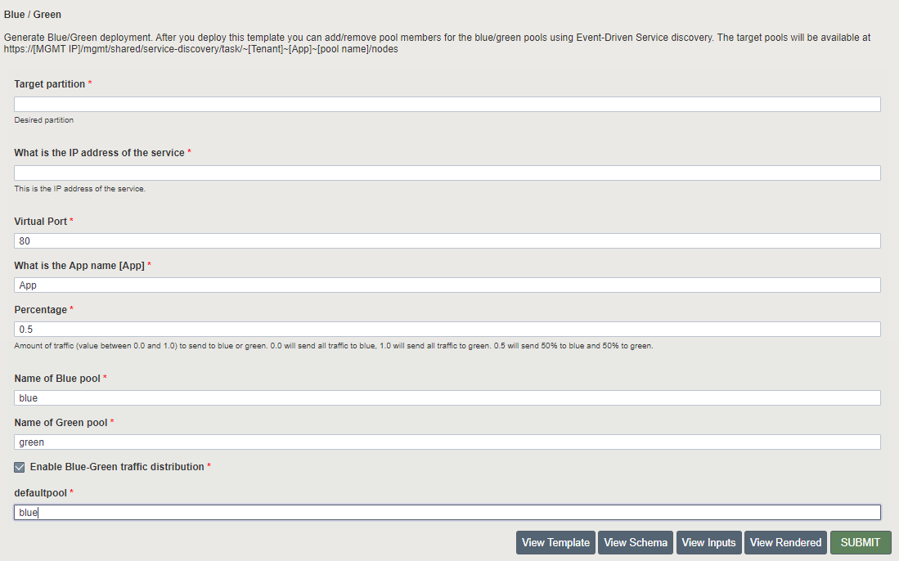

# FAST Template of AS3 Blue / Green

## About

This provides a FAST template for creating a Blue/Green deployment of an HTTP service.

The inputs that you provide are 
- the BIG-IP partition in which the configuration will be deployed (e.g. Tenant1)
- the destination address of the virtual server address (e.g. 10.1.10.1)
- the service port for the virtual server (e.g. 80)
- the name of the application service (e.g. MyApplication)
- the proportion of traffic that you want to send to the "green" pool, from 0.0 to 1.0 (e.g. 0.7)
- the name of the "blue" pool (e.g. blue_pool)
- the name of the "green" pool (e.g. green_pool)
- whether to enable the routing iRule
- the name of the default pool (e.g. blue_pool)

Once you deploy the template you can update the members of the blue and green pools using Event-Driven Service Discovery.

## Installing

You will need to have both [AS3](https://github.com/F5Networks/f5-appsvcs-extension) (3.24 or later recommended) / [FAST](https://github.com/F5Networks/f5-appsvcs-templates) installed on the target BIG-IP devices.

To install the template you will need to create a zip file of the `bluegreen.yml` file:

```bash
$ zip -r bluegreen.zip bluegreen.yaml
```

Upload the zip file as a FAST template.  Once installed you can configure via the GUI



Or via the API.

```bash
$ cat parameters.json
{"name":"bluegreen/bluegreen",
"parameters": {
      "partition": "Test",
      "virtualAddress": "192.0.2.10",
      "virtualPort": 80,
      "application": "App",
      "distribution": "0.5",
      "bluePool": "blue",
      "greenPool": "green",
      "enableBGDistribution": true,
      "defaultPool": "blue"
    }
}
$ curl -u admin:[password] -k -H content-type:application/json https://[mgmt ip]/mgmt/shared/fast/applications
```

Updates to the pools can be done via the Event-Driven service discovery API.

```
# update blue
$ cat blue.json
[
    {
        "id": "blue",
        "ip": "192.168.128.2",
        "port": 80
    }
]
$ curl -u admin:$PASSWORD https://[MGMT IP]/mgmt/shared/service-discovery/task/~[Partition]~[App Name]~blue/nodes -H content-type:application/json -d @./blue.json -k
# update green
$ cat green.json
[
    {
        "id": "green",
        "ip": "192.168.128.3",
        "port": 80
    }
]
$ curl -u admin:$PASSWORD https://[MGMT IP]/mgmt/shared/service-discovery/task/~[Partition]~[App Name]~green/nodes -H content-type:application/json -d @./green.json -k
```

## Results

You should traffic match the distribution that you input.

```
$ curl 192.0.2.10
Server address: 192.168.128.2:80
Server name: node1
Date: 05/Feb/2021:11:38:48 +0000
URI: /
Request ID: a224e13fd6ac596bbe0ca8ad7fa0ac48
$ curl 192.0.2.10
Server address: 192.168.128.3:80
Server name: node2
Date: 05/Feb/2021:11:38:58 +0000
URI: /
Request ID: ea7e5fbd8ee7455420673838a29575aa
```