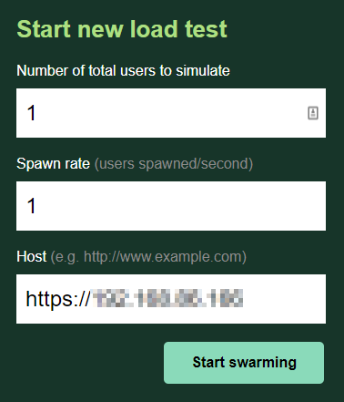

# Using Locust to step through a Blue-Green Scenario

## FIRST
Build a BIG-IP and maybe a jumphost

## Basic Setup
There's some [pre-work](COMMON-SETUP.md)

## Setup information for each of the VIPs
Within the ```vips.py``` file, edit the VIPS_INFO array, adding a record for each VIP. The fields are *virtual address*, *AS3 Tenant Name*, and *AS3 Application Name*.

```python
VIP_INFO = [
    ("192.0.2.10","Test","App"),
    ("192.0.2.11","Test2","App")
]
```
## Start an AS3BUFFER container
Which can be found [here](https://github.com/mjmenger/as3buffer). And, don't forget to prime the pump as described in the as3buffer README.

## Start a Locust Instance
at a command line, define the following environment variables
```bash
# IP or FQDN of BIG-IP
export BUFFER_ADDRESS="http://jumphost:8080"
# number of seconds between steps in the blue-green workflow
export BLUEGREEN_STEP_WAIT="300"
export BLUEGREEN_STEP_WAIT_MIN="60"
```

in the same command line session run the following command to start locust. 
```shell
docker run --env BIGIP_USER=$JENKINS_ADMIN_ID --env BIGIP_PASS=$JENKINS_ADMIN_PASSWORD --env BIGIP_MGMT_URI=$BIGIP_MGMT_URI --env BLUEGREEN_STEP_WAIT_MIN=$BLUEGREEN_STEP_WAIT_MIN --env BLUEGREEN_STEP_WAIT=$BLUEGREEN_STEP_WAIT -p 8089:8089 -v $PWD:/mnt/locust locustio/locust -f /mnt/locust/jenkins-as3-bluegreen-test.py --host $BUFFER_ADDRESS
```

The [Docker site](https://docs.docker.com/) and others have more elaborate information on the various command line parameters. The options used here are:
- Environment variables are set within the docker container to be used by Locust
```shell
--env BIGIP_USER=$BIGIP_USER --env BIGIP_PASS=$BIGIP_PASS
```
- A port from within the container is exposed outside the container to provide access to the Locust UI
```shell
-p 8089:8089
```
- The current working directory is exposed as a volume within the container to provide access to the ```fast-as3-bluegree-test.py``` test tasks file
```shell
-v $PWD:/mnt/locust
```

## Run the test
- open ```http://hostname:8089```  

- set the number of users to spawn and the spawn rate  

- watch the process  

