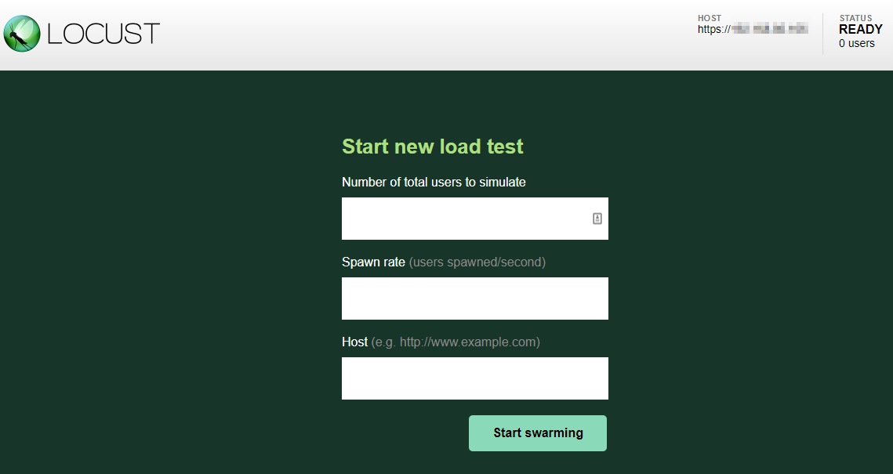
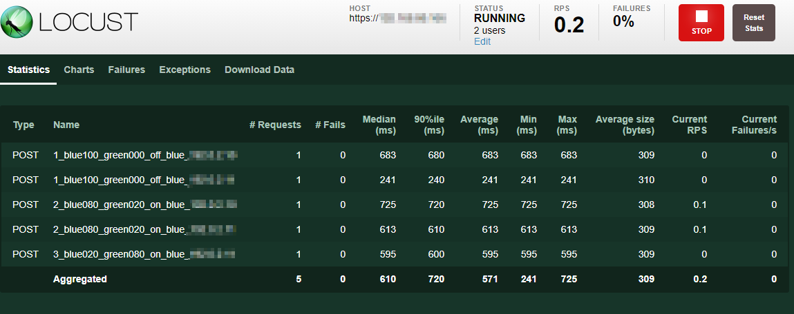

# Using Locust to step through a Blue-Green Scenario

## Install AS3 and FAST on the target BIG-IPs
- Follow [these directions](https://clouddocs.f5.com/products/extensions/f5-appsvcs-extension/latest/userguide/installation.html#installation) to install AS3  
- Follow [these directions](https://clouddocs.f5.com/products/extensions/f5-appsvcs-templates/latest/userguide/install-uninstall.html) to install F5 Applications Services Templates (FAST)

## Install the BlueGreen FAST Template
- create a zip file of the `bluegreen.yml` file:

```bash
$ zip -r bluegreen.zip bluegreen.yaml
```
- Log into the target BIG-IP
- Navigate to iApps -> Application Services -> Applications LX
- Click on ```F5 Application Services Templates```
- Click on the ```Templates``` tab
- Click on ```Add Template Set``` 
- Follow the subsequent steps using the ```bluegreen.zip``` file created above

## Install Docker
If you don't already have Docker installed, [install Docker](https://docs.docker.com/get-docker/)

## Setup information for each of the VIPs
Within the ```vips.py``` file, edit the VIPS_INFO array, adding a record for each VIP. The fields are *virtual address*, *AS3 Tenant Name*, and *AS3 Application Name*.

```python
VIP_INFO = [
    ("192.0.2.10","Test","App"),
    ("192.0.2.11","Test2","App")
]
```

## Start a Locust Instance
at a command line, define the following environment variables
```shell
export BIGIP_ADDRESS="https://ip-or-fqdn-of-big-ip"
export BIGIP_USER="admin"
export BIGIP_PASS="password-for-admin-account-on-big-ip"
```

in the same command line session run the following command to start locust. Note you can adjust the value of BLUEGREEN_STEP_WAIT to the number of seconds to wait between steps in the blue-green workflow.
```shell
docker run --env BIGIP_USER=$BIGIP_USER --env BIGIP_PASS=$BIGIP_PASS --env BLUEGREEN_STEP_WAIT=300 -p 8089:8089 -v $PWD:/mnt/locust locustio/locust -f /mnt/locust/fast-as3-bluegreen-test.py --host $BIGIP_ADDRESS
```

The [Docker site](https://docs.docker.com/) and others have more elaborate information on the various command line parameters. The options used here are:
- Environment variables are set within the docker container to be used by Locust
```shell
--env BIGIP_USER=$BIGIP_USER --env BIGIP_PASS=$BIGIP_PASS
```
- A port from within the container is exposed outside the container to provide access to the Locust UI
```shell
-p 8089:8089
```
- The current working directory is exposed as a volume within the container to provide access to the ```fast-as3-bluegree-test.py``` test tasks file
```shell
-v $PWD:/mnt/locust
```

## Run the test
- open ```http://hostname:8089```

- set the number of users to spawn and the spawn rate

- watch the process

